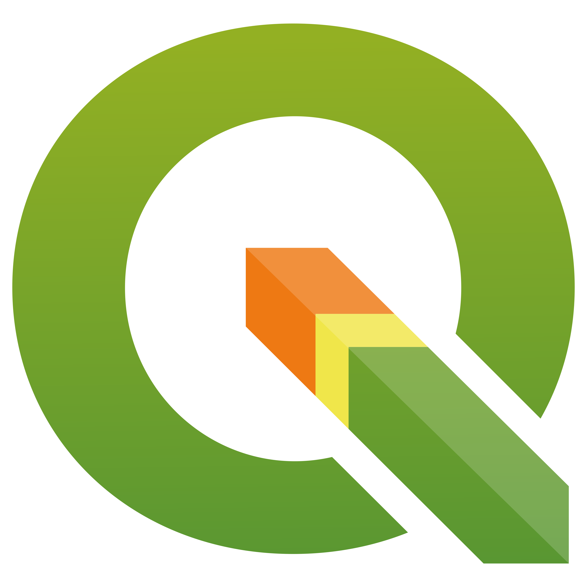

# Edit Vector Data with *QGIS*

- Pre-workshop activities: 5 min 
- Introductory presentation: 30 min
- Hands-on activities: 60 min

## Why QGIS? 

[QGIS](https://qgis.org/download/){:target="_blank"} is a free, open source desktop Geographic Information Systems (GIS) package that allows users to analyze and edit spatial information and create and export maps.

## This Workshop
With vector data, participants will edit both attributes and spatial geometry vector data in QGIS. This introductory workshop will cover basic concepts in GIS and QGIS, and will include exercises on utilising vector data, adding styles and labels, filtering, and making a map. This workshop is designed to help students who are new to QGIS to understand and utilize some of the main features.

### Note
With *QGIS* someone could:
- create beautiful maps
and/or
- conduct spatial analysis

*QGIS* has hundreds of tools and possiblites...
This workshop is an **Introduction** to *QGIS* with editing vector data

## Learning objectives
- Identify and navigate key QGIS interface elements
	(Layers panel, Menu bar, Map view)
- Define three types of vector data: shapefile, GeoJSON, Geopackage
- Edit attribute tables and vector data using QGIS tools

## Learning Outcomes
Using *QGIS*, participants will:
- Load and edit vector files (Shapefile, GeoJSON, geopackage)
- Change Symbology of vector layers
- Edit vector layers using digitizing
- Edit vector layer attribute tables
- Package vector layers into a Geopackage (.gpkg)

[NEXT STEP: Pre-Workshop Activities](pre-workshop.html){: .btn .btn-blue }
